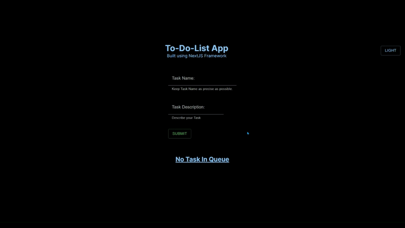

# To-Do-List-Application

**Built using NextJS Framework**

**A To-Do List Application to create, track, update, delete those tasks that you have to work on in near future, the tasks you are currently working on or the tasks that you have completed recently.**

#

## Application Features:

1. Create Tasks with their Description.
2. Edit your Tasks if needed & Mark your Tasks completed once done.
3. Switch between Light & Dark mode based on your preference.

## Preview of App features:

**Create Tasks with their Description:**

**Edit your Tasks if needed & Mark your Tasks completed once done:**

**Switch between Light & Dark mode based on your preference**

#

[🔼 Back to top](https://github.com/SidP919/NextJS-Project-ToDo-List-Application#readme)

#

Developed By:

**Sidharth Pandey**

 

**Happy Learning!** ☺️